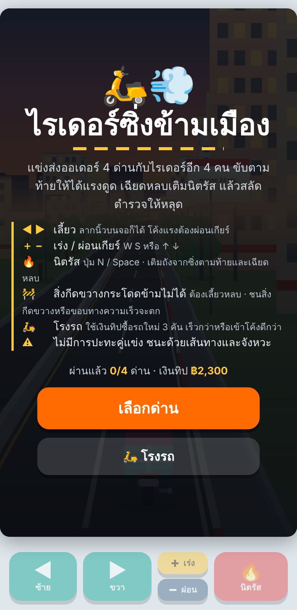
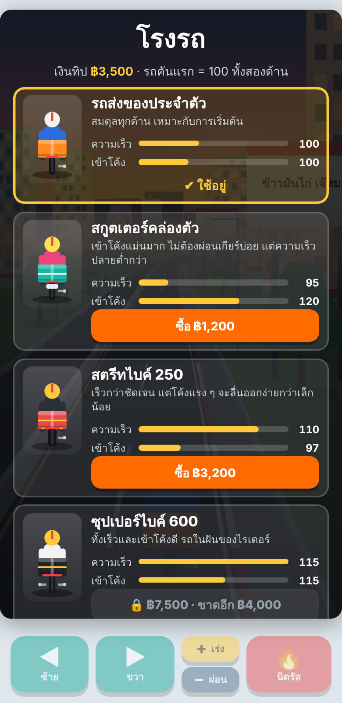
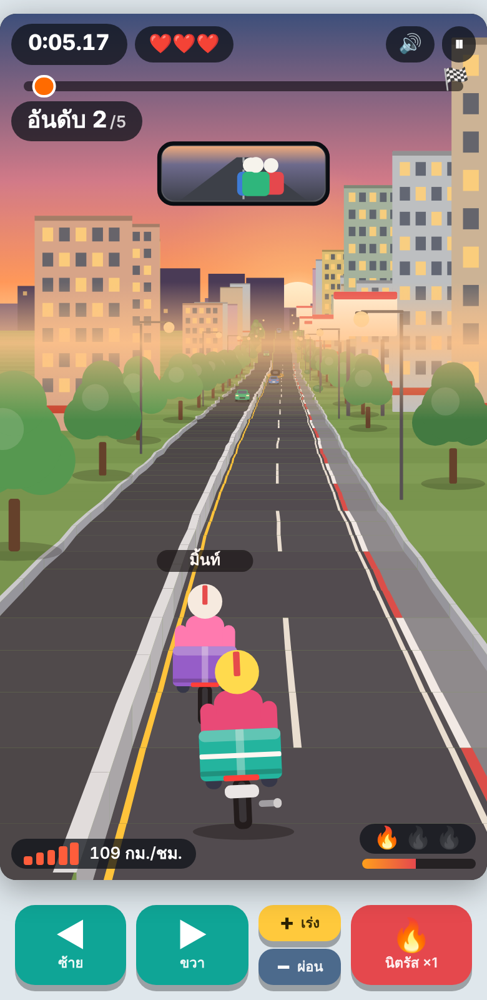
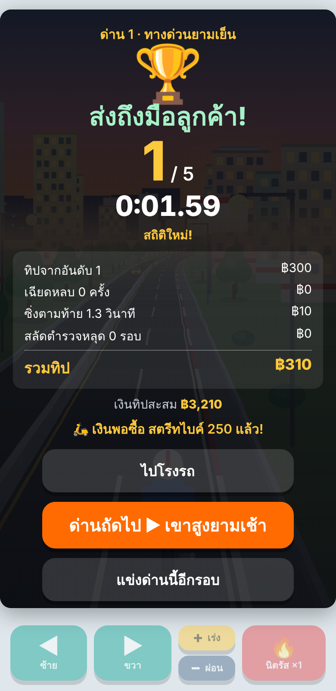

# 🏍️ ไรเดอร์ซิ่งข้ามเมือง (Rider Rush)

เกมไรเดอร์ส่งของมุมมองหลังรถ สไตล์ Road Rash II แต่ **ไม่มีการต่อสู้** — ชนะด้วยเส้นทางและจังหวะ
เขียนด้วย HTML + CSS + JavaScript ไฟล์เดียว (`index.html`) วาดภาพ pseudo-3D ลง `<canvas>` เอง
ไม่ต้องใช้ไลบรารี ไม่ต้อง build ไม่มีไฟล์ภาพ/เสียงภายนอก (เสียงสังเคราะห์ด้วย Web Audio)

 
 

## เล่นอย่างไร

เปิด `index.html` ในเบราว์เซอร์ได้เลย (ดับเบิลคลิก) หรือเปิดผ่าน GitHub Pages (ดูด้านล่าง)

| การควบคุม | คีย์บอร์ด | มือถือ |
|---|---|---|
| เลี้ยวซ้าย/ขวา | ← → หรือ A D | ปุ่ม ซ้าย/ขวา หรือลากนิ้วบนจอ |
| เร่ง / ผ่อนเกียร์ | ↑ ↓ หรือ W S | ปุ่ม + เร่ง / − ผ่อน |
| นิตรัส | N, Shift หรือ Space | ปุ่ม นิตรัส |
| พัก | P หรือ Esc | ปุ่มพักบนหน้าจอ |

- ส่งของให้ถึงเส้นชัยให้เร็วที่สุดและได้อันดับดี แข่งกับไรเดอร์อีก 4 คน
- **ซิ่งตามท้าย** (slipstream) เติมถังนิตรัส · **เฉียดหลบ** รถและสิ่งกีดขวางได้โบนัส
- **ตำรวจ** ไล่ตาม — ถ้าถูกประกบนานเกินไปจะถูกจับ สลัดหลุดได้โบนัสทิป
- ชนรถเสียพัสดุ 1 ชิ้น (มี 3 ชิ้น) · **สิ่งกีดขวางกระโดดข้ามไม่ได้ ต้องเลี้ยวหลบ**
- **ชนขอบทางความเร็วตก** — ขอบซ้าย (แบริเออร์กลางถนน) เสียหนักกว่าขอบขวา (การ์ดเรล)
- โค้งแรงต้องผ่อนเกียร์ ไม่เช่นนั้นรถจะถูกเหวี่ยงออกนอกเส้น

## ด่าน (4 ด่าน)

1. 🌇 ทางด่วนยามเย็น — วอร์มอัพ
2. 🌄 เขาสูงยามเช้า — โค้งหักศอก เนินชัน หินร่วง
3. 🌃 ราตรีใจกลางเมือง — มืด ไฟนีออน แผงกั้นงานซ่อม
4. ⛈ พายุฝนข้ามจังหวัด — ถนนลื่น ฝนหนัก ตำรวจไล่สองรอบ

บันทึกสถิติเวลา อันดับ และเงินทิปไว้ใน `localStorage` ของเบราว์เซอร์ (คีย์ `rider-rush-v2`)

## 🛵 โรงรถ

เงินทิป (฿) ที่ได้จากการแข่งใช้ซื้อรถใหม่ได้ (แตะซื้อ 2 ครั้งเพื่อยืนยัน)

| รถ | ราคา | ความเร็ว | เข้าโค้ง | จุดเด่น |
|---|---|---|---|---|
| รถส่งของประจำตัว | ฟรี | 100 | 100 | สมดุล |
| สกูตเตอร์คล่องตัว | ฿1,200 | 95 | 120 | ไม่ต้องผ่อนเกียร์บ่อย เหมาะด่านโค้งเยอะ |
| สตรีทไบค์ 250 | ฿3,200 | 110 | 97 | เร็วขึ้นชัดเจน |
| ซุปเปอร์ไบค์ 600 | ฿7,500 | 115 | 115 | ดีที่สุดทั้งสองด้าน |

ค่าอยู่ใน `BIKES` ใน `index.html` (`spd` = ตัวคูณความเร็ว, `cor` = อัตราเข้าโค้ง) ปรับราคาและสเตตัสได้ที่นั่น

## ขึ้น GitHub

```bash
cd rider-rush-repo
git init
git add .
git commit -m "Rider Rush: เกมไรเดอร์ซิ่งข้ามเมือง"
git branch -M main
git remote add origin https://github.com/<ชื่อผู้ใช้>/<ชื่อ-repo>.git
git push -u origin main
```

**เปิดให้คนอื่นเล่นผ่านเว็บ (GitHub Pages):** Settings → Pages → Source: *Deploy from a branch* →
Branch `main` / `/ (root)` → Save จากนั้นรอสักครู่จะได้ลิงก์ `https://<ชื่อผู้ใช้>.github.io/<ชื่อ-repo>/`

หมายเหตุ: ฟอนต์ Kanit โหลดจาก Google Fonts (ถ้าโหลดไม่ได้จะใช้ฟอนต์สำรองของเครื่อง เกมยังเล่นได้ปกติ)
ถ้าต้องการให้ทำงานออฟไลน์ 100% ให้ดาวน์โหลดฟอนต์มาเก็บใน repo แล้วเปลี่ยน `<link>` เป็น `@font-face`

## โครงสร้างโฟลเดอร์

```
index.html            เกมทั้งหมด (HTML+CSS+JS ไฟล์เดียว)
docs/screenshots/     ภาพตัวอย่างสำหรับ README
archive/              เวอร์ชันแรก (มุมมองจากด้านบน) เก็บไว้เป็นประวัติ
tools/                สคริปต์ทดสอบอัตโนมัติ (ไม่จำเป็นต่อการเล่น)
```

## สคริปต์ทดสอบ (ไม่บังคับ)

ใช้ Node.js จำลองเกมในเครื่องโดยไม่ต้องเปิดเบราว์เซอร์ และมีบอทขับทดสอบความสมดุลของด่าน/รถ

```bash
cd tools
npm install
npm run flow      # ทดสอบเมนู → เลือกด่าน → แข่ง → ผลการแข่ง
npm run garage    # ทดสอบซื้อ/เลือกรถ และการหักเงิน
npm run wall      # ทดสอบความเร็วตกเมื่อชนขอบทาง
node bot.js 6 0   # บอทขับ 6 รอบ ด่านที่ 1 (ตัวเลือก: '{"bike":2}' เลือกรถ)
npm run browser   # ทดสอบหน้าจอจริงด้วย Playwright (ต้องติดตั้ง Chromium: npx playwright install chromium)
```

## ปรับแต่งที่น่าสนใจ

- ด่าน: อาร์เรย์ `STAGES` (ความหนาแน่นรถ/สิ่งกีดขวาง ความแรงโค้ง ความเร็วตำรวจ ตัวคูณทิป)
- ความเร็วคู่แข่ง: `rk` ของแต่ละด่าน · ตำรวจ: `pol`
- ฟิสิกส์พื้นฐาน: ค่าคงที่ `CRUISE`, `GEARS`, `ACC`, `BRAKE`, `CF` ต้นไฟล์สคริปต์

เทคนิคการวาดถนนอ้างอิงแนวคิด pseudo-3D แบบ OutRun (segment + projection) เขียนโค้ดใหม่ทั้งหมดสำหรับเกมนี้
